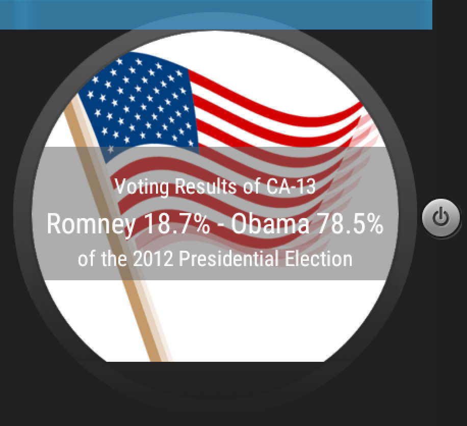

# PROG 02: Represent!

This app allows users to view representatives of their current location, or of any zipcode in the US. Another feature is a randomized zipcode, which is initiated by shaking the android wear device. 

## Authors

Filip Mirdita atidirmpilif@berkeley.edu

## Demo Video

https://youtu.be/Ut3G_6bewCM

## Screenshots

## Acknowledgments

* Hat tip to everyone on the internet for letting me copy and paste their code, but then modify and merge it enough with other people's code to the point where it's very difficult to credit anyone in particular, but that's just the era we live in so institutionalized education systems will need to learn to deal.
